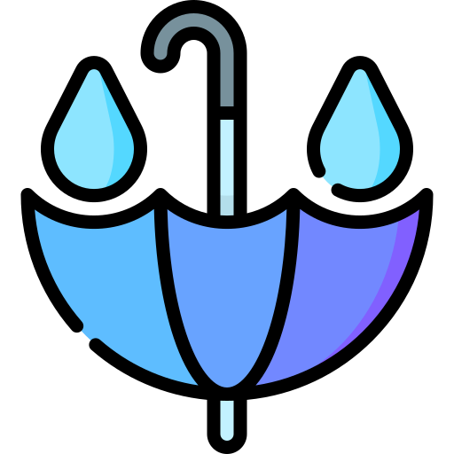
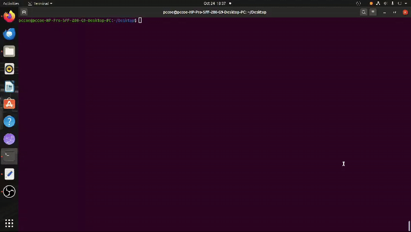

<!-- TITLE with Animated Typing Effect -->

  

  

 

<h1 align="center">🌧️ Rainwater Harvesting Simulation 🌧️</h1>
<h3 align="center">A basic OpenGL animation project showcasing environmental awareness through real-time graphics.</h3>

 

  

 

---

 

## 🚀 Project Overview

> ⚠️ **Note:** This project requires an **OpenGL-supported C++ environment**, such as **Code::Blocks with GLUT** or a compatible compiler setup.

This simulation presents a simple **rainwater harvesting system** using **OpenGL in C++**, where falling raindrops are animated to collect into a gutter system and finally stored in a tank. It offers a visual representation of how basic rainwater harvesting works in real life.

🧩 The project is a **modified version of an existing project** found online — we refined the visuals, animation flow, and structural layout to better suit academic or demonstration purposes. The original source could not be verified, hence credit could not be given.

 

  

 

---

 

## 🛠️ Tech Stack and Tools

 

<table>
  <thead>
    <tr>
      <th>Technology</th>
      <th>Purpose</th>
    </tr>
  </thead>
  <tbody>
    <tr>
      <td>C++</td>
      <td>Project logic and control flow</td>
    </tr>
    <tr>
      <td>OpenGL</td>
      <td>Rendering graphics and animation</td>
    </tr>
    <tr>
      <td>GLUT</td>
      <td>Utility toolkit for OpenGL window handling</td>
    </tr>
  </tbody>
</table>

 

---

 

## 🔍 Core Highlights

- 🌧️ Animated rainfall using OpenGL primitives  
- 🚰 Gutter and tank system simulating real-world rainwater flow  
- 🧱 Object rendering, translation, and timing control  
- ✨ Real-time environment animation for demo or educational purposes  
- 🛠️ Modified from an existing, uncredited source for improved clarity and presentation  

 

---

 

## 📚 Key Learning Outcomes

- Learned how to animate multiple objects using **OpenGL and GLUT**  
- Applied frame-based logic for environmental simulation  
- Improved understanding of **environmental awareness through code**  
- Practiced structuring graphics projects for academic demos  
- Gained experience modifying and repurposing legacy OpenGL codebases  

 

---

 

## 👨‍💻 About the Creator

**Sumdiboii** – Developer, Designer & Visual Thinker 💡🧠  

*LinkedIn – [Sumedh Pimplikar](https://www.linkedin.com/in/sumedh-pimplikar)*

 

> **“Rain is temporary. Learning is forever.”**  
> *This simulation reflects how code and climate awareness can meet in motion.* 🌧️💻🌱
